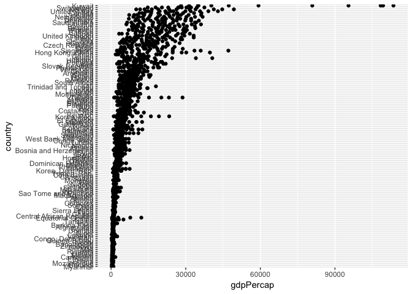
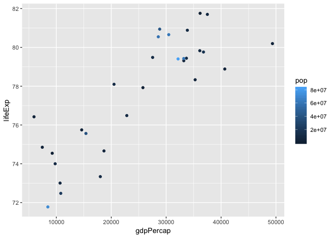
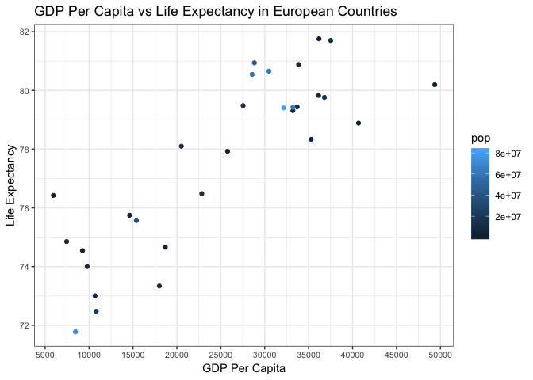

hw05-zhamadeh
================

Lets start by bringing in all of our important packages

``` r
suppressPackageStartupMessages(library(gapminder))
suppressPackageStartupMessages(library(tidyverse))
suppressPackageStartupMessages(library(forcats))
suppressPackageStartupMessages(library(knitr))
suppressPackageStartupMessages(library(readr))
suppressPackageStartupMessages(library(scales))
suppressPackageStartupMessages(library(plotly))
```

Part 1 Factor Management
========================

With the data set of your choice, after ensuring the variable(s) you’re exploring are indeed factors, you are expected to:

Drop factor / levels;

-   Reorder levels based on knowledge from data.
-   We’ve elaborated on these steps for the gapminder and singer data sets below.

Be sure to also characterize the (derived) data before and after your factor re-leveling:

-   Explore the effects of arrange(). Does merely arranging the data have any effect on, say, a figure?
-   Explore the effects of reordering a factor and factor reordering coupled with arrange(). Especially, what effect does this have on a figure? These explorations should involve the data, the factor levels, and some figures.

### Elaboration of the gapminder dataset

Lets start out by looking at the variable, continent, in the gapminder dataset. The `class()` method tells us this is a factor variable. The `levels()` method shows us what the factor levels are of the continent variable.

``` r
class(gapminder$continent)
```

    ## [1] "factor"

``` r
levels(gapminder$continent)
```

    ## [1] "Africa"   "Americas" "Asia"     "Europe"   "Oceania"

**Dropping Oceania** First lets remove any observations that have Oceania as their continent by making use of the `filter()` method on the gapminder dataset and store this in a new variable.

``` r
filt_gapminder <- gapminder %>%
  filter(continent != "Oceania") #keeps all continents that are NOT Oceania
```

Looking at our new filtered dataset, we can see that Oceania is still a level in the continent variable but the `table()` function tells us it has zero observations.

``` r
levels(filt_gapminder$continent)
```

    ## [1] "Africa"   "Americas" "Asia"     "Europe"   "Oceania"

``` r
table(filt_gapminder$continent)
```

    ## 
    ##   Africa Americas     Asia   Europe  Oceania 
    ##      624      300      396      360        0

To remove this unused factor level we need to use the `droplevels()` method on our new dataset. A quick table view of the continents and their observation counts tells us Oceania was successfully removed.

``` r
filt_gapminder <- droplevels(filt_gapminder)
table(filt_gapminder$continent)
```

    ## 
    ##   Africa Americas     Asia   Europe 
    ##      624      300      396      360

A quick look at the number of rows in our new dataset compared to the original gapminder gives us more information. There are 1704 rows in the original gapminder dataset and only 1680 in our new filtered one suggesting 24 rows belonged to observations with Oceania as their continent. Comparing our levels of continent also shows that Oceania has been removed from our filtered dataset.

``` r
#difference in row number
nrow(gapminder)
```

    ## [1] 1704

``` r
nrow(filt_gapminder)
```

    ## [1] 1680

``` r
#different in factor levels
levels(gapminder$continent)
```

    ## [1] "Africa"   "Americas" "Asia"     "Europe"   "Oceania"

``` r
levels(filt_gapminder$continent)
```

    ## [1] "Africa"   "Americas" "Asia"     "Europe"

**Reorder the levels of `country` and `continent`** Here we can reorder the levels of our country variable according to another variable, GDP per capita, using the `fct_reorder()` method and then plotting the results.

``` r
filt_gapminder %>%
  mutate(country = fct_reorder(country, gdpPercap)) %>% #reorder country by GDP per capita
  ggplot(aes(gdpPercap, country)) + 
  geom_point()
```



Alternatively, we can arrange the levels of the continent factor by frequency using the `fct_infreq()` method and printing out the levels to confirm.

``` r
filt_gapminder$continent %>%
  fct_infreq() %>%
  levels()
```

    ## [1] "Africa"   "Asia"     "Europe"   "Americas"

Part 2 File I/O
===============

Lets create a new gapminder dataset to a comma seperated values file titled gapminder.csv.

``` r
gap_europe_2007 <- gapminder %>%
  filter(continent == "Europe", year == 2007)

readr::write_csv(gap_europe_2007, "europe_2007.csv")
```

Part 3 Visualization and Design
===============================

``` r
euro_old_plot <- gap_europe_2007 %>%
  ggplot(aes(gdpPercap, lifeExp)) + geom_point(aes(colour=pop))


euro_new_plot <- gap_europe_2007 %>%
  ggplot(aes(gdpPercap, lifeExp)) + geom_point(aes(colour=pop))+
  geom_text(aes(label=country),hjust=0, vjust=0, size = 2) +
  scale_x_continuous(
    breaks = 1:10 * 5000,
    labels=dollar_format()) + 
  theme_bw()+
  theme(axis.text = element_text(size=8)) + 
  labs(title = "GDP Per Capita vs Life Expectancy in European Countries", x = "GDP Per Capita", y = "Life Expectancy") 

euro_old_plot # this is the original graph
```



``` r
euro_new_plot # this is the new graph
```



``` r
euro_new_plot %>% # this is the new graph printed with plotly
  ggplotly() 
```

<!--html_preserve-->

<script type="application/json" data-for="htmlwidget-3308aafc8edcd2f2c554">{"x":{"data":[{"x":[5937.029526,36126.4927,33692.60508,7446.298803,10680.79282,14619.22272,22833.30851,35278.41874,33207.0844,30470.0167,32170.37442,27538.41188,18008.94444,36180.78919,40675.99635,28569.7197,9253.896111,36797.93332,49357.19017,15389.92468,20509.64777,10808.47561,9786.534714,18678.31435,25768.25759,28821.0637,33859.74835,37506.41907,8458.276384,33203.26128],"y":[76.423,79.829,79.441,74.852,73.005,75.748,76.486,78.332,79.313,80.657,79.406,79.483,73.338,81.757,78.885,80.546,74.543,79.762,80.196,75.563,78.098,72.476,74.002,74.663,77.926,80.941,80.884,81.701,71.777,79.425],"text":["pop:  3600523<br />gdpPercap:  5937.030<br />lifeExp: 76.423","pop:  8199783<br />gdpPercap: 36126.493<br />lifeExp: 79.829","pop: 10392226<br />gdpPercap: 33692.605<br />lifeExp: 79.441","pop:  4552198<br />gdpPercap:  7446.299<br />lifeExp: 74.852","pop:  7322858<br />gdpPercap: 10680.793<br />lifeExp: 73.005","pop:  4493312<br />gdpPercap: 14619.223<br />lifeExp: 75.748","pop: 10228744<br />gdpPercap: 22833.309<br />lifeExp: 76.486","pop:  5468120<br />gdpPercap: 35278.419<br />lifeExp: 78.332","pop:  5238460<br />gdpPercap: 33207.084<br />lifeExp: 79.313","pop: 61083916<br />gdpPercap: 30470.017<br />lifeExp: 80.657","pop: 82400996<br />gdpPercap: 32170.374<br />lifeExp: 79.406","pop: 10706290<br />gdpPercap: 27538.412<br />lifeExp: 79.483","pop:  9956108<br />gdpPercap: 18008.944<br />lifeExp: 73.338","pop:   301931<br />gdpPercap: 36180.789<br />lifeExp: 81.757","pop:  4109086<br />gdpPercap: 40675.996<br />lifeExp: 78.885","pop: 58147733<br />gdpPercap: 28569.720<br />lifeExp: 80.546","pop:   684736<br />gdpPercap:  9253.896<br />lifeExp: 74.543","pop: 16570613<br />gdpPercap: 36797.933<br />lifeExp: 79.762","pop:  4627926<br />gdpPercap: 49357.190<br />lifeExp: 80.196","pop: 38518241<br />gdpPercap: 15389.925<br />lifeExp: 75.563","pop: 10642836<br />gdpPercap: 20509.648<br />lifeExp: 78.098","pop: 22276056<br />gdpPercap: 10808.476<br />lifeExp: 72.476","pop: 10150265<br />gdpPercap:  9786.535<br />lifeExp: 74.002","pop:  5447502<br />gdpPercap: 18678.314<br />lifeExp: 74.663","pop:  2009245<br />gdpPercap: 25768.258<br />lifeExp: 77.926","pop: 40448191<br />gdpPercap: 28821.064<br />lifeExp: 80.941","pop:  9031088<br />gdpPercap: 33859.748<br />lifeExp: 80.884","pop:  7554661<br />gdpPercap: 37506.419<br />lifeExp: 81.701","pop: 71158647<br />gdpPercap:  8458.276<br />lifeExp: 71.777","pop: 60776238<br />gdpPercap: 33203.261<br />lifeExp: 79.425"],"type":"scatter","mode":"markers","marker":{"autocolorscale":false,"color":["rgba(21,48,73,1)","rgba(25,54,82,1)","rgba(26,58,87,1)","rgba(22,49,75,1)","rgba(24,53,81,1)","rgba(22,49,75,1)","rgba(26,57,86,1)","rgba(23,50,77,1)","rgba(23,50,77,1)","rgba(67,139,197,1)","rgba(86,177,247,1)","rgba(27,58,87,1)","rgba(26,57,86,1)","rgba(19,43,67,1)","rgba(22,48,74,1)","rgba(65,134,190,1)","rgba(19,44,68,1)","rgba(31,67,99,1)","rgba(22,49,75,1)","rgba(48,101,146,1)","rgba(27,58,87,1)","rgba(36,76,111,1)","rgba(26,57,86,1)","rgba(23,50,77,1)","rgba(20,45,70,1)","rgba(50,105,150,1)","rgba(25,56,84,1)","rgba(24,53,81,1)","rgba(76,157,220,1)","rgba(67,139,196,1)"],"opacity":1,"size":5.66929133858268,"symbol":"circle","line":{"width":1.88976377952756,"color":["rgba(21,48,73,1)","rgba(25,54,82,1)","rgba(26,58,87,1)","rgba(22,49,75,1)","rgba(24,53,81,1)","rgba(22,49,75,1)","rgba(26,57,86,1)","rgba(23,50,77,1)","rgba(23,50,77,1)","rgba(67,139,197,1)","rgba(86,177,247,1)","rgba(27,58,87,1)","rgba(26,57,86,1)","rgba(19,43,67,1)","rgba(22,48,74,1)","rgba(65,134,190,1)","rgba(19,44,68,1)","rgba(31,67,99,1)","rgba(22,49,75,1)","rgba(48,101,146,1)","rgba(27,58,87,1)","rgba(36,76,111,1)","rgba(26,57,86,1)","rgba(23,50,77,1)","rgba(20,45,70,1)","rgba(50,105,150,1)","rgba(25,56,84,1)","rgba(24,53,81,1)","rgba(76,157,220,1)","rgba(67,139,196,1)"]}},"hoveron":"points","showlegend":false,"xaxis":"x","yaxis":"y","hoverinfo":"text","frame":null},{"x":[5937.029526,36126.4927,33692.60508,7446.298803,10680.79282,14619.22272,22833.30851,35278.41874,33207.0844,30470.0167,32170.37442,27538.41188,18008.94444,36180.78919,40675.99635,28569.7197,9253.896111,36797.93332,49357.19017,15389.92468,20509.64777,10808.47561,9786.534714,18678.31435,25768.25759,28821.0637,33859.74835,37506.41907,8458.276384,33203.26128],"y":[76.423,79.829,79.441,74.852,73.005,75.748,76.486,78.332,79.313,80.657,79.406,79.483,73.338,81.757,78.885,80.546,74.543,79.762,80.196,75.563,78.098,72.476,74.002,74.663,77.926,80.941,80.884,81.701,71.777,79.425],"text":["Albania","Austria","Belgium","Bosnia and Herzegovina","Bulgaria","Croatia","Czech Republic","Denmark","Finland","France","Germany","Greece","Hungary","Iceland","Ireland","Italy","Montenegro","Netherlands","Norway","Poland","Portugal","Romania","Serbia","Slovak Republic","Slovenia","Spain","Sweden","Switzerland","Turkey","United Kingdom"],"hovertext":["country: Albania<br />gdpPercap:  5937.030<br />lifeExp: 76.423","country: Austria<br />gdpPercap: 36126.493<br />lifeExp: 79.829","country: Belgium<br />gdpPercap: 33692.605<br />lifeExp: 79.441","country: Bosnia and Herzegovina<br />gdpPercap:  7446.299<br />lifeExp: 74.852","country: Bulgaria<br />gdpPercap: 10680.793<br />lifeExp: 73.005","country: Croatia<br />gdpPercap: 14619.223<br />lifeExp: 75.748","country: Czech Republic<br />gdpPercap: 22833.309<br />lifeExp: 76.486","country: Denmark<br />gdpPercap: 35278.419<br />lifeExp: 78.332","country: Finland<br />gdpPercap: 33207.084<br />lifeExp: 79.313","country: France<br />gdpPercap: 30470.017<br />lifeExp: 80.657","country: Germany<br />gdpPercap: 32170.374<br />lifeExp: 79.406","country: Greece<br />gdpPercap: 27538.412<br />lifeExp: 79.483","country: Hungary<br />gdpPercap: 18008.944<br />lifeExp: 73.338","country: Iceland<br />gdpPercap: 36180.789<br />lifeExp: 81.757","country: Ireland<br />gdpPercap: 40675.996<br />lifeExp: 78.885","country: Italy<br />gdpPercap: 28569.720<br />lifeExp: 80.546","country: Montenegro<br />gdpPercap:  9253.896<br />lifeExp: 74.543","country: Netherlands<br />gdpPercap: 36797.933<br />lifeExp: 79.762","country: Norway<br />gdpPercap: 49357.190<br />lifeExp: 80.196","country: Poland<br />gdpPercap: 15389.925<br />lifeExp: 75.563","country: Portugal<br />gdpPercap: 20509.648<br />lifeExp: 78.098","country: Romania<br />gdpPercap: 10808.476<br />lifeExp: 72.476","country: Serbia<br />gdpPercap:  9786.535<br />lifeExp: 74.002","country: Slovak Republic<br />gdpPercap: 18678.314<br />lifeExp: 74.663","country: Slovenia<br />gdpPercap: 25768.258<br />lifeExp: 77.926","country: Spain<br />gdpPercap: 28821.064<br />lifeExp: 80.941","country: Sweden<br />gdpPercap: 33859.748<br />lifeExp: 80.884","country: Switzerland<br />gdpPercap: 37506.419<br />lifeExp: 81.701","country: Turkey<br />gdpPercap:  8458.276<br />lifeExp: 71.777","country: United Kingdom<br />gdpPercap: 33203.261<br />lifeExp: 79.425"],"textfont":{"size":7.55905511811024,"color":"rgba(0,0,0,1)"},"type":"scatter","mode":"text","hoveron":"points","showlegend":false,"xaxis":"x","yaxis":"y","hoverinfo":"text","frame":null},{"x":[5000],"y":[72],"name":"99_a04497eb1c555ef8616b92f02c29b69a","type":"scatter","mode":"markers","opacity":0,"hoverinfo":"none","showlegend":false,"marker":{"color":[0,1],"colorscale":[[0,"#132B43"],[0.0526315789473684,"#16314B"],[0.105263157894737,"#193754"],[0.157894736842105,"#1D3E5C"],[0.210526315789474,"#204465"],[0.263157894736842,"#234B6E"],[0.315789473684211,"#275277"],[0.368421052631579,"#2A5980"],[0.421052631578947,"#2E608A"],[0.473684210526316,"#316793"],[0.526315789473684,"#356E9D"],[0.578947368421053,"#3875A6"],[0.631578947368421,"#3C7CB0"],[0.684210526315789,"#3F83BA"],[0.736842105263158,"#438BC4"],[0.789473684210526,"#4792CE"],[0.842105263157895,"#4B9AD8"],[0.894736842105263,"#4EA2E2"],[0.947368421052632,"#52A9ED"],[1,"#56B1F7"]],"colorbar":{"bgcolor":"rgba(255,255,255,1)","bordercolor":"transparent","borderwidth":1.88976377952756,"thickness":23.04,"title":"pop","titlefont":{"color":"rgba(0,0,0,1)","family":"","size":14.6118721461187},"tickmode":"array","ticktext":["2e+07","4e+07","6e+07","8e+07"],"tickvals":[0.239930491291222,0.483538624952672,0.727146758614121,0.97075489227557],"tickfont":{"color":"rgba(0,0,0,1)","family":"","size":11.689497716895},"ticklen":2,"len":0.5}},"xaxis":"x","yaxis":"y","frame":null}],"layout":{"margin":{"t":43.7625570776256,"r":7.30593607305936,"b":39.1199667911997,"l":36.1975923619759},"plot_bgcolor":"rgba(255,255,255,1)","paper_bgcolor":"rgba(255,255,255,1)","font":{"color":"rgba(0,0,0,1)","family":"","size":14.6118721461187},"title":"GDP Per Capita vs Life Expectancy in European Countries","titlefont":{"color":"rgba(0,0,0,1)","family":"","size":17.5342465753425},"xaxis":{"domain":[0,1],"automargin":true,"type":"linear","autorange":false,"range":[3766.0214938,51528.1982022],"tickmode":"array","ticktext":["$5,000","$10,000","$15,000","$20,000","$25,000","$30,000","$35,000","$40,000","$45,000","$50,000"],"tickvals":[5000,10000,15000,20000,25000,30000,35000,40000,45000,50000],"categoryorder":"array","categoryarray":["$5,000","$10,000","$15,000","$20,000","$25,000","$30,000","$35,000","$40,000","$45,000","$50,000"],"nticks":null,"ticks":"outside","tickcolor":"rgba(51,51,51,1)","ticklen":3.65296803652968,"tickwidth":0.66417600664176,"showticklabels":true,"tickfont":{"color":"rgba(77,77,77,1)","family":"","size":10.6268161062682},"tickangle":-0,"showline":false,"linecolor":null,"linewidth":0,"showgrid":true,"gridcolor":"rgba(235,235,235,1)","gridwidth":0.66417600664176,"zeroline":false,"anchor":"y","title":"GDP Per Capita","titlefont":{"color":"rgba(0,0,0,1)","family":"","size":14.6118721461187},"hoverformat":".2f"},"yaxis":{"domain":[0,1],"automargin":true,"type":"linear","autorange":false,"range":[71.278,82.256],"tickmode":"array","ticktext":["72","74","76","78","80","82"],"tickvals":[72,74,76,78,80,82],"categoryorder":"array","categoryarray":["72","74","76","78","80","82"],"nticks":null,"ticks":"outside","tickcolor":"rgba(51,51,51,1)","ticklen":3.65296803652968,"tickwidth":0.66417600664176,"showticklabels":true,"tickfont":{"color":"rgba(77,77,77,1)","family":"","size":10.6268161062682},"tickangle":-0,"showline":false,"linecolor":null,"linewidth":0,"showgrid":true,"gridcolor":"rgba(235,235,235,1)","gridwidth":0.66417600664176,"zeroline":false,"anchor":"x","title":"Life Expectancy","titlefont":{"color":"rgba(0,0,0,1)","family":"","size":14.6118721461187},"hoverformat":".2f"},"shapes":[{"type":"rect","fillcolor":"transparent","line":{"color":"rgba(51,51,51,1)","width":0.66417600664176,"linetype":"solid"},"yref":"paper","xref":"paper","x0":0,"x1":1,"y0":0,"y1":1}],"showlegend":false,"legend":{"bgcolor":"rgba(255,255,255,1)","bordercolor":"transparent","borderwidth":1.88976377952756,"font":{"color":"rgba(0,0,0,1)","family":"","size":11.689497716895}},"hovermode":"closest","barmode":"relative"},"config":{"doubleClick":"reset","modeBarButtonsToAdd":[{"name":"Collaborate","icon":{"width":1000,"ascent":500,"descent":-50,"path":"M487 375c7-10 9-23 5-36l-79-259c-3-12-11-23-22-31-11-8-22-12-35-12l-263 0c-15 0-29 5-43 15-13 10-23 23-28 37-5 13-5 25-1 37 0 0 0 3 1 7 1 5 1 8 1 11 0 2 0 4-1 6 0 3-1 5-1 6 1 2 2 4 3 6 1 2 2 4 4 6 2 3 4 5 5 7 5 7 9 16 13 26 4 10 7 19 9 26 0 2 0 5 0 9-1 4-1 6 0 8 0 2 2 5 4 8 3 3 5 5 5 7 4 6 8 15 12 26 4 11 7 19 7 26 1 1 0 4 0 9-1 4-1 7 0 8 1 2 3 5 6 8 4 4 6 6 6 7 4 5 8 13 13 24 4 11 7 20 7 28 1 1 0 4 0 7-1 3-1 6-1 7 0 2 1 4 3 6 1 1 3 4 5 6 2 3 3 5 5 6 1 2 3 5 4 9 2 3 3 7 5 10 1 3 2 6 4 10 2 4 4 7 6 9 2 3 4 5 7 7 3 2 7 3 11 3 3 0 8 0 13-1l0-1c7 2 12 2 14 2l218 0c14 0 25-5 32-16 8-10 10-23 6-37l-79-259c-7-22-13-37-20-43-7-7-19-10-37-10l-248 0c-5 0-9-2-11-5-2-3-2-7 0-12 4-13 18-20 41-20l264 0c5 0 10 2 16 5 5 3 8 6 10 11l85 282c2 5 2 10 2 17 7-3 13-7 17-13z m-304 0c-1-3-1-5 0-7 1-1 3-2 6-2l174 0c2 0 4 1 7 2 2 2 4 4 5 7l6 18c0 3 0 5-1 7-1 1-3 2-6 2l-173 0c-3 0-5-1-8-2-2-2-4-4-4-7z m-24-73c-1-3-1-5 0-7 2-2 3-2 6-2l174 0c2 0 5 0 7 2 3 2 4 4 5 7l6 18c1 2 0 5-1 6-1 2-3 3-5 3l-174 0c-3 0-5-1-7-3-3-1-4-4-5-6z"},"click":"function(gd) { \n        // is this being viewed in RStudio?\n        if (location.search == '?viewer_pane=1') {\n          alert('To learn about plotly for collaboration, visit:\\n https://cpsievert.github.io/plotly_book/plot-ly-for-collaboration.html');\n        } else {\n          window.open('https://cpsievert.github.io/plotly_book/plot-ly-for-collaboration.html', '_blank');\n        }\n      }"}],"cloud":false},"source":"A","attrs":{"4e7c7d4b5e91":{"colour":{},"x":{},"y":{},"type":"scatter"},"4e7c5f2dc1da":{"label":{},"x":{},"y":{}}},"cur_data":"4e7c7d4b5e91","visdat":{"4e7c7d4b5e91":["function (y) ","x"],"4e7c5f2dc1da":["function (y) ","x"]},"highlight":{"on":"plotly_click","persistent":false,"dynamic":false,"selectize":false,"opacityDim":0.2,"selected":{"opacity":1},"debounce":0},"base_url":"https://plot.ly"},"evals":["config.modeBarButtonsToAdd.0.click"],"jsHooks":[]}</script>
<!--/html_preserve-->
Part 4 Writing figures to file
==============================

Use `ggsave()` to explicitly save a plot to file.

``` r
ggsave("euro_new_plot.png", euro_new_plot, width = 10, dpi = 500)
```

    ## Saving 10 x 5 in image
